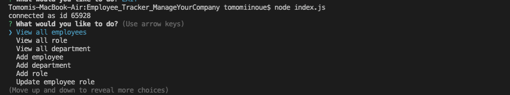
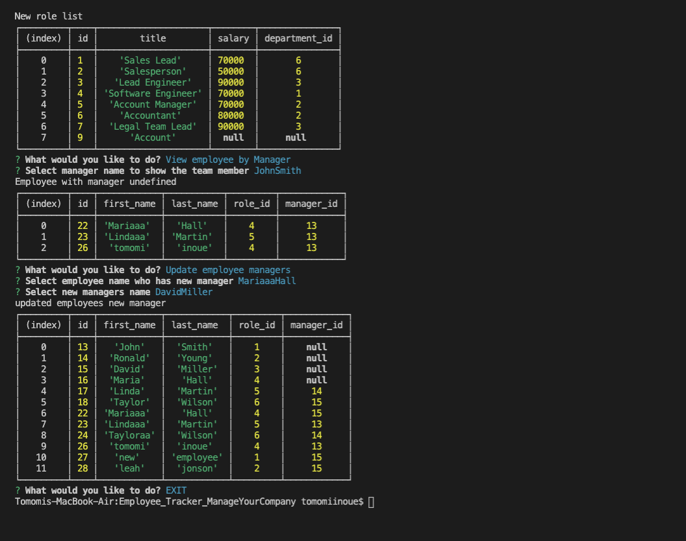

# Employee_Tracker_ManageYourCompany
<h3>BCS Homework Week12</h3>

<!-- TABLE OF CONTENTS -->

  
Table of Contents

  <ol>
    <li>
      <a href="#about-the-project">About The Project</a>
    </li>
      <li><a href="#built-with">Built With</a></li>
    <li><a href="#license">License</a></li>
    <li><a href="#Learning">Learning</a></li>
    <li><a href="#contact">Contact</a></li>
  </ol>

<!-- ABOUT THE PROJECT -->
## About The Project
Node.js to create employee tacker for a company management. Using mysql, inquirer to build the functions.
When the person start running the index.hs, it askes questions. Then, we can view all employees, all roles, and all departments the company has. Also, we can add employees, roles, and department. Finally, we can update the employee's role as well.

* First inquirer prompt when you run node index.js

* showing database tables 

* Demo movie of the functions

## Built With

Major framework I used to create this application.

* [MYSQL](https://www.npmjs.com/package/mysql)
* [InquirerJs](https://www.npmjs.com/package/inquirer/v/0.2.3)

## Learning

Using mysql and organizing the database by using node.js. I struggled for making update function, from what data I can get from the answer and what I can pass it to. Ended up those bonus functions helped me to understand it deeper. 

<!-- LICENSE -->
## License

<!-- CONTACT -->
## Contact

Tomomi Inoue 
 

Project Link: [https://github.com/Chib1co/Employee_Tracker_ManageYourCompany](https://github.com/Chib1co/Employee_Tracker_ManageYourCompany)

